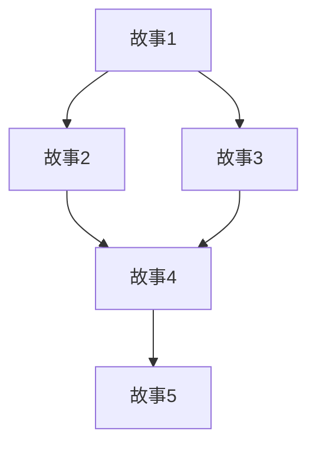
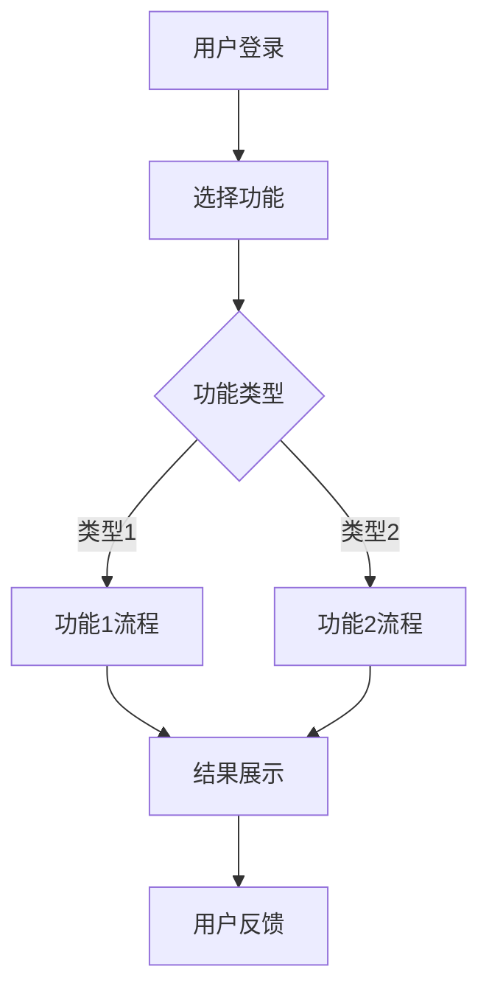
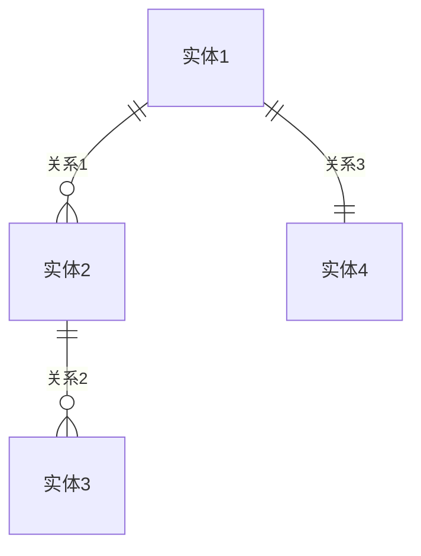

# G3 PRD关卡检查表

## 🎯 关卡目标

基于可行性评估结果，制定详细的产品需求文档，包括用户故事、功能规格、非功能性需求和验收标准。

## ✅ 通过标准

### 1. 用户故事完整性 (User Stories)

- [ ] **故事数量合理**
  - 3-7个核心用户故事
  - 覆盖主要用户场景
  - 故事粒度适中
  - 优先级明确
  - 依赖关系清晰

- [ ] **故事质量标准**
  - 遵循 "As a [用户角色], I want [功能], so that [价值]" 格式
  - 每个故事都有明确的 Given/When/Then 验收标准
  - 故事可测试和可演示
  - 业务价值明确
  - 技术实现可行

### 2. PRD文档完整性 (Product Requirements Document)

- [ ] **产品概述**
  - 产品愿景和目标
  - 目标用户群体
  - 核心价值主张
  - 产品定位
  - 成功指标定义

- [ ] **功能需求**
  - 核心功能详细描述
  - 功能优先级排序
  - 用户交互流程
  - 业务规则定义
  - 数据需求说明

- [ ] **非功能性需求 (NFR)**
  - 性能要求
  - 可用性要求
  - 安全性要求
  - 可扩展性要求
  - 兼容性要求

### 3. 范围边界清晰

- [ ] **包含范围 (In Scope)**
  - MVP 核心功能
  - 必需的集成
  - 基础用户体验
  - 关键业务流程
  - 基本安全措施

- [ ] **排除范围 (Out of Scope)**
  - 高级功能特性
  - 非关键集成
  - 优化和增强
  - 未来版本功能
  - 边缘用例处理

### 4. 数据和分析需求

- [ ] **埋点策略**
  - 用户行为跟踪
  - 业务指标监控
  - 技术性能监控
  - 错误和异常跟踪
  - 转化漏斗分析

- [ ] **关键指标 (KPI)**
  - 北极星指标定义
  - 业务指标体系
  - 技术指标体系
  - 用户体验指标
  - 运营效率指标

## 📋 必备输出文档

### 1. 用户故事集合

```markdown
# 用户故事集合

## 故事 1: [故事标题]
**优先级**: 高/中/低  
**估算**: [故事点数]  
**依赖**: [依赖的其他故事]

### 用户故事
As a [用户角色],  
I want [功能描述],  
So that [业务价值].

### 验收标准 (Given/When/Then)
**Given** [前置条件]  
**When** [用户操作]  
**Then** [预期结果]

**Given** [前置条件]  
**When** [用户操作]  
**Then** [预期结果]

**Given** [前置条件]  
**When** [用户操作]  
**Then** [预期结果]

### 业务规则
- [规则1]: [描述]
- [规则2]: [描述]
- [规则3]: [描述]

### 技术约束
- [约束1]: [描述]
- [约束2]: [描述]
- [约束3]: [描述]

### 测试场景
- [ ] 正常流程测试
- [ ] 边界条件测试
- [ ] 异常情况测试
- [ ] 性能测试
- [ ] 安全测试

---

## 故事 2: [故事标题]
[重复上述格式]

## 故事 3: [故事标题]
[重复上述格式]

## 故事依赖关系图


## 故事优先级矩阵
| 故事 | 业务价值 | 技术复杂度 | 用户影响 | 优先级 | 冲刺 |
|------|----------|------------|----------|--------|------|
| 故事1 | 高 | 中 | 高 | P0 | Sprint 1 |
| 故事2 | 高 | 低 | 中 | P0 | Sprint 1 |
| 故事3 | 中 | 高 | 高 | P1 | Sprint 2 |
| 故事4 | 中 | 中 | 中 | P1 | Sprint 2 |
| 故事5 | 低 | 低 | 低 | P2 | Sprint 3 |
```

### 2. 产品需求文档 (PRD)

```markdown
# 产品需求文档 (PRD)

## 1. 产品概述

### 1.1 产品愿景
[产品的长期愿景和目标]

### 1.2 产品目标
- **主要目标**: [核心目标]
- **次要目标**: [支撑目标]
- **成功指标**: [可量化的成功标准]

### 1.3 目标用户
#### 主要用户群体
- **用户画像1**: [详细描述]
  - 基本信息: [年龄、职业、收入等]
  - 使用场景: [何时何地使用]
  - 核心需求: [主要痛点和需求]
  - 技术水平: [技术接受度]

- **用户画像2**: [详细描述]
  - 基本信息: [年龄、职业、收入等]
  - 使用场景: [何时何地使用]
  - 核心需求: [主要痛点和需求]
  - 技术水平: [技术接受度]

### 1.4 价值主张
- **核心价值**: [为用户解决的核心问题]
- **差异化优势**: [与竞品的区别]
- **用户收益**: [用户获得的具体收益]

## 2. 功能需求

### 2.1 核心功能
#### 功能1: [功能名称]
- **描述**: [功能详细描述]
- **用户价值**: [为用户带来的价值]
- **业务规则**: [相关业务规则]
- **输入**: [功能输入]
- **输出**: [功能输出]
- **异常处理**: [异常情况处理]

#### 功能2: [功能名称]
- **描述**: [功能详细描述]
- **用户价值**: [为用户带来的价值]
- **业务规则**: [相关业务规则]
- **输入**: [功能输入]
- **输出**: [功能输出]
- **异常处理**: [异常情况处理]

### 2.2 用户交互流程


### 2.3 数据模型
#### 核心实体
- **实体1**: [实体描述]
  - 属性1: [类型] - [描述]
  - 属性2: [类型] - [描述]
  - 属性3: [类型] - [描述]

- **实体2**: [实体描述]
  - 属性1: [类型] - [描述]
  - 属性2: [类型] - [描述]
  - 属性3: [类型] - [描述]

#### 实体关系


## 3. 非功能性需求 (NFR)

### 3.1 性能要求
- **响应时间**: API响应时间 < 500ms (95%)
- **吞吐量**: 支持1000并发用户
- **页面加载**: 首屏加载时间 < 2秒
- **数据处理**: 批量处理能力 > 10000条/分钟

### 3.2 可用性要求
- **系统可用性**: 99.9% (月度)
- **故障恢复**: RTO < 1小时, RPO < 15分钟
- **维护窗口**: 每月不超过4小时
- **监控告警**: 关键指标实时监控

### 3.3 安全性要求
- **身份认证**: 多因素认证支持
- **数据加密**: 传输和存储加密
- **访问控制**: 基于角色的权限控制
- **审计日志**: 完整的操作审计
- **合规要求**: GDPR/CCPA合规

### 3.4 可扩展性要求
- **水平扩展**: 支持微服务架构
- **数据库扩展**: 支持读写分离和分片
- **缓存策略**: 多级缓存支持
- **CDN支持**: 静态资源CDN分发

### 3.5 兼容性要求
- **浏览器支持**: Chrome 90+, Firefox 88+, Safari 14+
- **移动设备**: iOS 14+, Android 10+
- **API版本**: 向后兼容至少2个版本
- **数据格式**: JSON/XML标准格式

## 4. 用户体验设计

### 4.1 设计原则
- **简洁性**: 界面简洁直观
- **一致性**: 交互模式一致
- **可访问性**: 支持无障碍访问
- **响应式**: 适配多种设备

### 4.2 关键页面
- **首页**: [页面目标和关键元素]
- **功能页**: [页面目标和关键元素]
- **设置页**: [页面目标和关键元素]

### 4.3 交互规范
- **按钮**: [样式和行为规范]
- **表单**: [输入验证和反馈]
- **导航**: [导航结构和逻辑]
- **反馈**: [成功/错误/加载状态]

## 5. 集成需求

### 5.1 第三方集成
| 服务类型 | 服务商 | 集成方式 | 用途 | 优先级 |
|----------|--------|----------|------|--------|
| 支付 | [服务商] | API | 支付处理 | 高 |
| 认证 | [服务商] | OAuth | 用户认证 | 高 |
| 邮件 | [服务商] | API | 邮件发送 | 中 |
| 分析 | [服务商] | SDK | 数据分析 | 中 |

### 5.2 内部系统集成
- **CRM系统**: [集成目的和方式]
- **ERP系统**: [集成目的和方式]
- **数据仓库**: [集成目的和方式]

## 6. 数据和分析

### 6.1 埋点策略
#### 页面级埋点
- **页面访问**: 页面PV/UV统计
- **停留时间**: 用户页面停留时长
- **跳出率**: 单页面访问跳出率
- **加载性能**: 页面加载时间分布

#### 功能级埋点
- **功能使用**: 各功能使用频次
- **操作路径**: 用户操作路径分析
- **转化漏斗**: 关键流程转化率
- **错误跟踪**: 功能错误和异常

#### 业务级埋点
- **用户注册**: 注册来源和转化
- **用户活跃**: DAU/MAU统计
- **收入指标**: 收入和付费转化
- **留存分析**: 用户留存率分析

### 6.2 关键指标 (KPI)
#### 北极星指标
- **主指标**: [核心业务指标]
- **目标值**: [具体数值目标]
- **监控频率**: [监控和报告频率]

#### 业务指标
- **用户增长**: 新用户注册数
- **用户活跃**: DAU/WAU/MAU
- **用户留存**: 次日/7日/30日留存率
- **收入指标**: MRR/ARR增长率
- **转化指标**: 注册转化率、付费转化率

#### 技术指标
- **性能指标**: 响应时间、吞吐量
- **可用性**: 系统可用率、故障时间
- **错误率**: API错误率、页面错误率
- **资源使用**: CPU、内存、存储使用率

## 7. 失败场景和文案

### 7.1 系统错误
#### 服务器错误 (5xx)
- **错误信息**: "服务暂时不可用，请稍后重试"
- **用户指导**: "如果问题持续，请联系客服"
- **技术信息**: 错误代码和时间戳
- **恢复建议**: 自动重试机制

#### 网络错误
- **错误信息**: "网络连接异常，请检查网络设置"
- **用户指导**: "请检查网络连接后重试"
- **技术信息**: 网络状态检测
- **恢复建议**: 离线模式或缓存

### 7.2 用户错误
#### 输入验证错误
- **错误信息**: 具体的字段错误提示
- **用户指导**: 明确的修正建议
- **视觉反馈**: 错误字段高亮
- **恢复建议**: 实时验证和提示

#### 权限错误
- **错误信息**: "您没有权限执行此操作"
- **用户指导**: "请联系管理员获取权限"
- **技术信息**: 权限级别说明
- **恢复建议**: 权限申请流程

### 7.3 业务逻辑错误
#### 数据冲突
- **错误信息**: "数据已被其他用户修改"
- **用户指导**: "请刷新页面后重试"
- **技术信息**: 冲突检测机制
- **恢复建议**: 乐观锁和冲突解决

#### 资源限制
- **错误信息**: "已达到使用限制"
- **用户指导**: "请升级套餐或联系客服"
- **技术信息**: 当前使用量和限制
- **恢复建议**: 升级引导流程

## 8. 项目范围边界

### 8.1 包含范围 (In Scope)
#### MVP 核心功能
- [ ] [功能1]: [具体描述]
- [ ] [功能2]: [具体描述]
- [ ] [功能3]: [具体描述]

#### 基础设施
- [ ] 用户认证和授权
- [ ] 基础数据管理
- [ ] 核心业务流程
- [ ] 基本监控和日志
- [ ] 移动端适配

#### 集成需求
- [ ] [集成1]: [集成范围]
- [ ] [集成2]: [集成范围]
- [ ] [集成3]: [集成范围]

### 8.2 排除范围 (Out of Scope)
#### 高级功能
- [ ] [功能1]: [排除原因]
- [ ] [功能2]: [排除原因]
- [ ] [功能3]: [排除原因]

#### 优化和增强
- [ ] 性能优化: 留待后续版本
- [ ] 高级分析: 非MVP必需
- [ ] 个性化推荐: 数据积累后实现
- [ ] 多语言支持: 市场验证后考虑

#### 边缘用例
- [ ] 极端数据量处理
- [ ] 复杂权限管理
- [ ] 高级自定义配置
- [ ] 企业级集成

### 8.3 未来版本规划
#### V2.0 规划
- [ ] [功能1]: [预期时间]
- [ ] [功能2]: [预期时间]
- [ ] [功能3]: [预期时间]

#### V3.0 规划
- [ ] [功能1]: [预期时间]
- [ ] [功能2]: [预期时间]
- [ ] [功能3]: [预期时间]
```

### 3. 接口规格草案

```markdown
# API 接口规格草案

## 1. 接口概述

### 1.1 基础信息
- **Base URL**: `https://api.example.com/v1`
- **认证方式**: Bearer Token (JWT)
- **数据格式**: JSON
- **字符编码**: UTF-8
- **API版本**: v1.0

### 1.2 通用响应格式
```json
{
  "success": true,
  "data": {},
  "message": "操作成功",
  "code": 200,
  "timestamp": "2024-01-01T00:00:00Z",
  "requestId": "uuid"
}
```

### 1.3 错误响应格式
```json
{
  "success": false,
  "error": {
    "code": "VALIDATION_ERROR",
    "message": "输入参数验证失败",
    "details": [
      {
        "field": "email",
        "message": "邮箱格式不正确"
      }
    ]
  },
  "timestamp": "2024-01-01T00:00:00Z",
  "requestId": "uuid"
}
```

## 2. 核心接口

### 2.1 用户管理

#### 用户注册
```
POST /auth/register
```

**请求参数**:
```json
{
  "email": "user@example.com",
  "password": "password123",
  "name": "用户姓名",
  "phone": "+86-13800138000"
}
```

**响应示例**:
```json
{
  "success": true,
  "data": {
    "userId": "uuid",
    "email": "user@example.com",
    "name": "用户姓名",
    "token": "jwt-token",
    "expiresAt": "2024-01-01T00:00:00Z"
  }
}
```

#### 用户登录
```
POST /auth/login
```

**请求参数**:
```json
{
  "email": "user@example.com",
  "password": "password123"
}
```

**响应示例**:
```json
{
  "success": true,
  "data": {
    "userId": "uuid",
    "token": "jwt-token",
    "refreshToken": "refresh-token",
    "expiresAt": "2024-01-01T00:00:00Z"
  }
}
```

### 2.2 核心业务接口

#### [业务接口1]
```
GET /api/resource
```

**查询参数**:
- `page`: 页码 (默认: 1)
- `limit`: 每页数量 (默认: 20, 最大: 100)
- `sort`: 排序字段 (默认: createdAt)
- `order`: 排序方向 (asc/desc, 默认: desc)
- `filter`: 过滤条件

**响应示例**:
```json
{
  "success": true,
  "data": {
    "items": [
      {
        "id": "uuid",
        "name": "资源名称",
        "status": "active",
        "createdAt": "2024-01-01T00:00:00Z",
        "updatedAt": "2024-01-01T00:00:00Z"
      }
    ],
    "pagination": {
      "page": 1,
      "limit": 20,
      "total": 100,
      "totalPages": 5
    }
  }
}
```

#### [业务接口2]
```
POST /api/resource
```

**请求参数**:
```json
{
  "name": "资源名称",
  "description": "资源描述",
  "type": "资源类型",
  "metadata": {
    "key1": "value1",
    "key2": "value2"
  }
}
```

**响应示例**:
```json
{
  "success": true,
  "data": {
    "id": "uuid",
    "name": "资源名称",
    "status": "created",
    "createdAt": "2024-01-01T00:00:00Z"
  }
}
```

## 3. 状态码说明

| 状态码 | 说明 | 示例场景 |
|--------|------|----------|
| 200 | 成功 | 正常请求处理 |
| 201 | 创建成功 | 资源创建成功 |
| 400 | 请求错误 | 参数验证失败 |
| 401 | 未授权 | Token无效或过期 |
| 403 | 禁止访问 | 权限不足 |
| 404 | 资源不存在 | 请求的资源不存在 |
| 409 | 冲突 | 资源已存在 |
| 422 | 处理失败 | 业务逻辑验证失败 |
| 429 | 请求过多 | 超出速率限制 |
| 500 | 服务器错误 | 内部服务器错误 |

## 4. 认证和授权

### 4.1 JWT Token 结构
```json
{
  "header": {
    "alg": "HS256",
    "typ": "JWT"
  },
  "payload": {
    "userId": "uuid",
    "email": "user@example.com",
    "role": "user",
    "permissions": ["read", "write"],
    "iat": 1640995200,
    "exp": 1641081600
  }
}
```

### 4.2 权限级别
- **guest**: 游客权限
- **user**: 普通用户权限
- **premium**: 高级用户权限
- **admin**: 管理员权限

## 5. 速率限制

| 用户类型 | 限制 | 时间窗口 |
|----------|------|----------|
| 游客 | 100 请求 | 1小时 |
| 普通用户 | 1000 请求 | 1小时 |
| 高级用户 | 5000 请求 | 1小时 |
| 管理员 | 10000 请求 | 1小时 |

## 6. 数据验证规则

### 6.1 通用规则
- **必填字段**: 不能为空或null
- **字符串长度**: 最小1字符，最大255字符
- **邮箱格式**: 符合RFC 5322标准
- **手机号格式**: 支持国际格式
- **密码强度**: 最少8位，包含字母和数字

### 6.2 业务规则
- **用户名**: 3-20字符，字母数字下划线
- **资源名称**: 1-100字符，不含特殊字符
- **描述**: 最大1000字符
- **标签**: 最多10个，每个最长20字符
```

## 🚨 拦截条件

以下情况下 **不得通过** G3 关卡:

- [ ] 用户故事少于3个或多于7个
- [ ] 用户故事缺乏明确的Given/When/Then验收标准
- [ ] PRD文档缺少关键章节
- [ ] 非功能性需求 (NFR) 不完整
- [ ] 产品范围边界不清晰
- [ ] 埋点策略缺失或不完整
- [ ] 失败场景和错误文案不完整
- [ ] 接口规格草案缺失
- [ ] 关键指标 (KPI) 定义不明确
- [ ] 与前期文档 (G0/G1/G2) 不一致

## 💼 投资人签字区

**PRD评估结果**: [ ] 通过 [ ] 有条件通过 [ ] 不通过

**投资人签字**: ________________  
**签字日期**: ________________  
**附加条件**: ________________

## 📈 下一步行动

**G3 通过后进入**: G4 架构与集成阶段

**移交给**: Architecture Agent (架构师)

**下阶段任务**:
- 设计系统架构
- 编写架构决策记录 (ADR)
- 制定SLO和错误预算
- 规划集成策略

---

**检查日期**: ________________  
**检查人员**: ________________  
**通过状态**: [ ] 通过 [ ] 不通过 [ ] 需补充材料  
**备注**: ________________