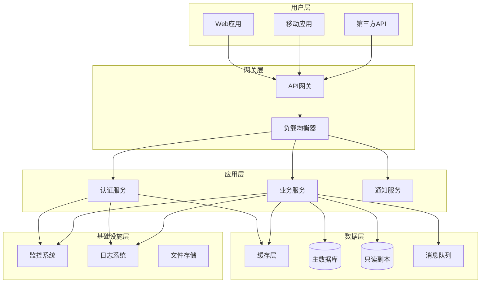
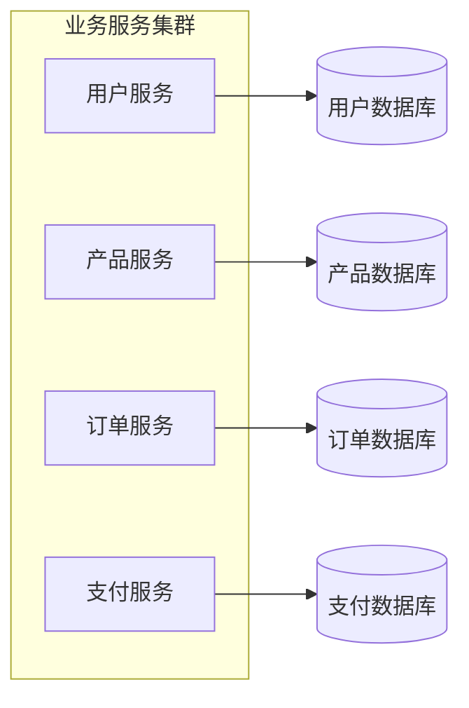
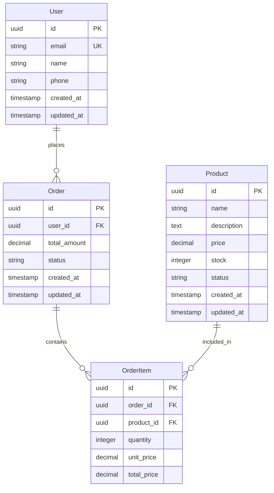
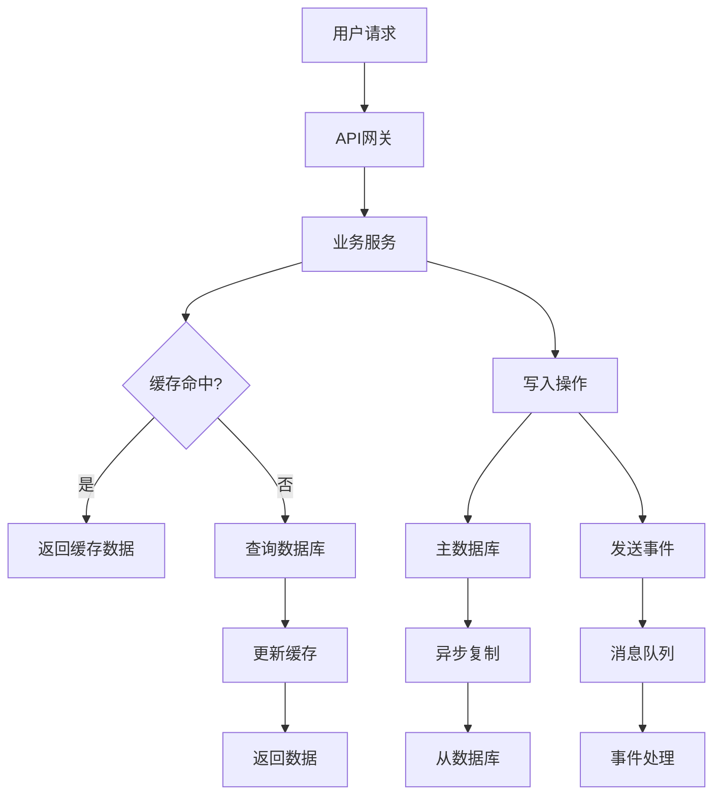
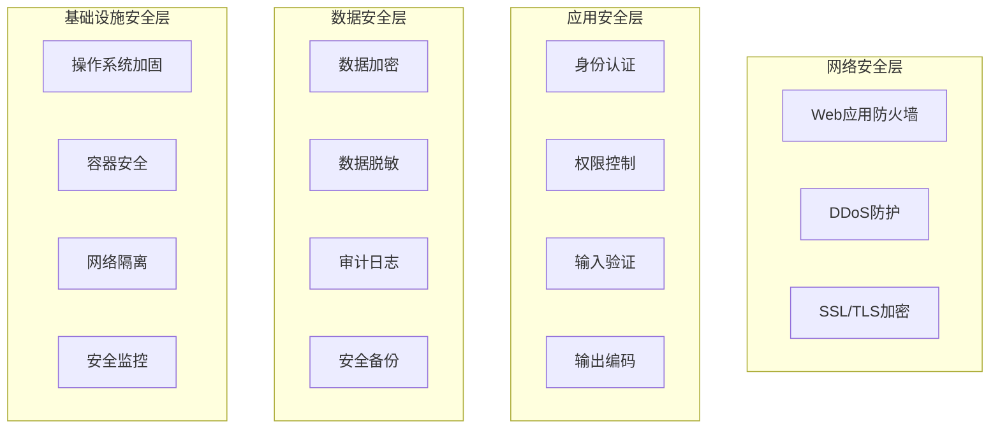
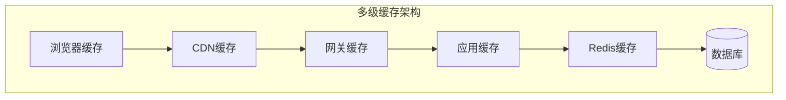
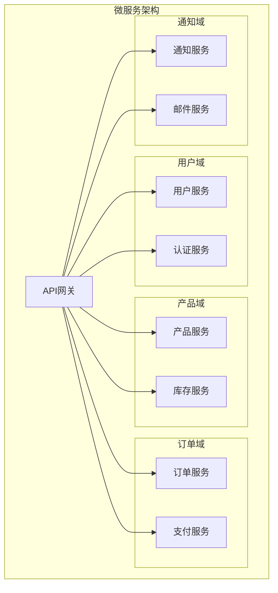
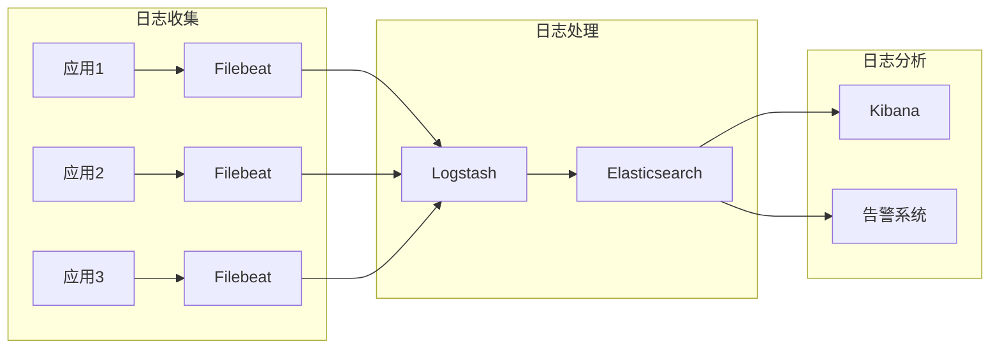
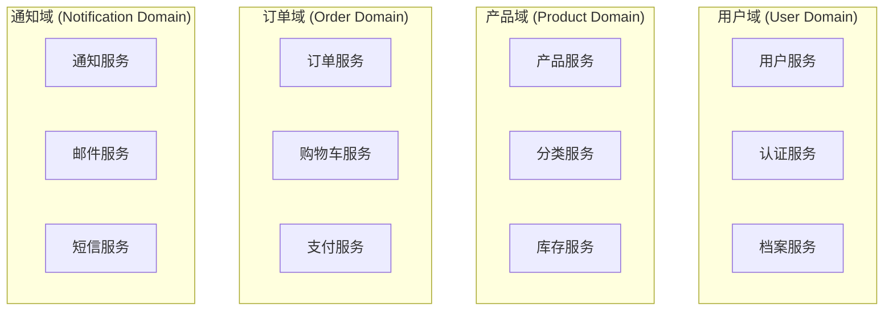
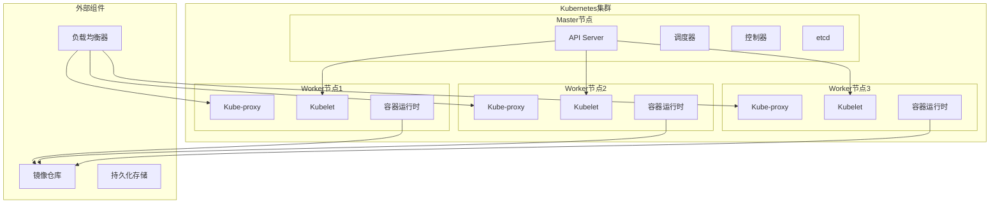

# G4 架构与集成关卡检查表

## 🎯 关卡目标

基于PRD需求，设计系统架构、制定技术决策、规划集成策略，并建立SLO和错误预算体系。

## ✅ 通过标准

### 1. 系统架构设计

- [ ] **整体架构清晰**
  - 系统分层架构图
  - 组件职责明确
  - 模块边界清晰
  - 数据流向明确
  - 部署架构图

- [ ] **技术栈选择合理**
  - 前端技术栈确定
  - 后端技术栈确定
  - 数据库选型合理
  - 中间件选择适当
  - 基础设施规划

- [ ] **可扩展性设计**
  - 水平扩展能力
  - 垂直扩展能力
  - 微服务架构考虑
  - 负载均衡策略
  - 缓存策略设计

### 2. 架构决策记录 (ADR)

- [ ] **ADR数量充足**
  - 至少2条关键ADR
  - 覆盖重要技术决策
  - 决策理由充分
  - 备选方案分析
  - 影响评估完整

- [ ] **ADR质量标准**
  - 决策背景清晰
  - 考虑因素全面
  - 决策结果明确
  - 后果分析透彻
  - 可追溯性强

### 3. 数据架构设计

- [ ] **数据模型设计**
  - 实体关系图 (ERD)
  - 数据字典完整
  - 索引策略设计
  - 数据分区策略
  - 数据生命周期管理

- [ ] **数据流设计**
  - 数据流向图
  - 数据处理流程
  - 数据同步策略
  - 数据一致性保证
  - 数据备份策略

### 4. 安全架构设计

- [ ] **认证授权体系**
  - 身份认证方案
  - 权限控制模型
  - 单点登录 (SSO)
  - 多因素认证 (MFA)
  - 会话管理策略

- [ ] **数据安全保护**
  - 数据加密策略
  - 传输安全保护
  - 存储安全保护
  - 敏感数据处理
  - 审计日志设计

### 5. 性能架构设计

- [ ] **性能优化策略**
  - 缓存架构设计
  - CDN策略规划
  - 数据库优化
  - 前端性能优化
  - 网络优化策略

- [ ] **监控体系设计**
  - 应用性能监控 (APM)
  - 基础设施监控
  - 业务指标监控
  - 日志收集分析
  - 告警机制设计

## 📋 必备输出文档

### 1. 系统架构文档

```markdown
# 系统架构设计文档

## 1. 架构概述

### 1.1 架构愿景
[系统架构的总体目标和愿景]

### 1.2 架构原则
- **可扩展性**: 支持业务快速增长
- **可靠性**: 确保系统稳定运行
- **安全性**: 保护数据和系统安全
- **性能**: 满足用户体验要求
- **可维护性**: 便于开发和运维

### 1.3 质量属性
| 质量属性 | 目标 | 度量标准 | 优先级 |
|----------|------|----------|--------|
| 可用性 | 99.9% | 月度可用率 | 高 |
| 性能 | <500ms | API响应时间 | 高 |
| 可扩展性 | 10x | 用户增长支持 | 中 |
| 安全性 | 零泄露 | 安全事件数 | 高 |
| 可维护性 | <1天 | 功能交付周期 | 中 |

## 2. 整体架构

### 2.1 系统架构图


### 2.2 分层架构
#### 表现层 (Presentation Layer)
- **Web前端**: React/Vue.js SPA应用
- **移动端**: React Native/Flutter应用
- **API文档**: OpenAPI/Swagger文档

#### 网关层 (Gateway Layer)
- **API网关**: 统一入口，路由分发
- **负载均衡**: 流量分发和故障转移
- **限流熔断**: 保护后端服务

#### 应用层 (Application Layer)
- **认证服务**: 用户认证和授权
- **业务服务**: 核心业务逻辑
- **通知服务**: 消息推送和通知

#### 数据层 (Data Layer)
- **缓存层**: Redis集群
- **数据库**: PostgreSQL主从架构
- **消息队列**: RabbitMQ/Kafka

#### 基础设施层 (Infrastructure Layer)
- **监控系统**: Prometheus + Grafana
- **日志系统**: ELK Stack
- **文件存储**: AWS S3/阿里云OSS

## 3. 核心组件设计

### 3.1 认证服务 (Auth Service)
#### 功能职责
- 用户注册和登录
- JWT Token生成和验证
- 权限控制和授权
- 会话管理
- 第三方登录集成

#### 技术实现
- **框架**: Spring Boot / Express.js
- **数据库**: PostgreSQL
- **缓存**: Redis
- **协议**: OAuth 2.0 / OpenID Connect

#### 接口设计
```yaml
paths:
  /auth/login:
    post:
      summary: 用户登录
      requestBody:
        required: true
        content:
          application/json:
            schema:
              type: object
              properties:
                email:
                  type: string
                password:
                  type: string
      responses:
        '200':
          description: 登录成功
          content:
            application/json:
              schema:
                type: object
                properties:
                  token:
                    type: string
                  expiresAt:
                    type: string
                    format: date-time
```

### 3.2 业务服务 (Business Service)
#### 功能职责
- 核心业务逻辑处理
- 数据CRUD操作
- 业务规则验证
- 事务管理
- 外部服务集成

#### 技术实现
- **框架**: Spring Boot / NestJS
- **数据库**: PostgreSQL
- **ORM**: JPA/Hibernate / TypeORM
- **事务**: 分布式事务支持

#### 服务拆分


### 3.3 数据访问层 (Data Access Layer)
#### 数据库设计
- **主数据库**: PostgreSQL 13+
- **读写分离**: 主从复制架构
- **分库分表**: 按业务域拆分
- **连接池**: HikariCP / pgbouncer

#### 缓存策略
- **L1缓存**: 应用内存缓存
- **L2缓存**: Redis分布式缓存
- **缓存模式**: Cache-Aside模式
- **过期策略**: TTL + LRU

## 4. 数据架构

### 4.1 数据模型
#### 核心实体关系图


### 4.2 数据流架构


### 4.3 数据一致性策略
- **强一致性**: 关键业务数据
- **最终一致性**: 非关键数据
- **事务管理**: ACID保证
- **分布式事务**: Saga模式

## 5. 安全架构

### 5.1 安全分层模型


### 5.2 认证授权体系
#### 认证方案
- **JWT Token**: 无状态认证
- **Refresh Token**: 长期有效性
- **多因素认证**: 短信/邮箱验证
- **第三方登录**: OAuth 2.0集成

#### 权限模型
- **RBAC**: 基于角色的访问控制
- **ABAC**: 基于属性的访问控制
- **资源权限**: 细粒度权限控制
- **动态权限**: 运行时权限检查

### 5.3 数据保护策略
- **传输加密**: TLS 1.3
- **存储加密**: AES-256
- **密钥管理**: HSM/KMS
- **敏感数据**: 字段级加密
- **数据脱敏**: 生产数据保护

## 6. 性能架构

### 6.1 性能优化策略
#### 前端优化
- **代码分割**: 按需加载
- **资源压缩**: Gzip/Brotli
- **CDN加速**: 静态资源分发
- **缓存策略**: 浏览器缓存
- **图片优化**: WebP格式

#### 后端优化
- **连接池**: 数据库连接复用
- **查询优化**: SQL性能调优
- **索引策略**: 合理索引设计
- **异步处理**: 非阻塞I/O
- **批量操作**: 减少网络开销

### 6.2 缓存架构


### 6.3 负载均衡策略
- **算法选择**: 轮询/加权轮询/最少连接
- **健康检查**: 自动故障检测
- **会话保持**: 粘性会话支持
- **故障转移**: 自动切换

## 7. 可扩展性设计

### 7.1 水平扩展
- **无状态设计**: 服务无状态化
- **负载均衡**: 多实例部署
- **数据分片**: 数据库分片
- **缓存集群**: Redis集群

### 7.2 垂直扩展
- **资源监控**: CPU/内存/磁盘
- **自动扩容**: 基于指标扩容
- **资源优化**: 性能调优
- **容量规划**: 增长预测

### 7.3 微服务架构


## 8. 监控和可观测性

### 8.1 监控体系
#### 应用监控
- **APM**: 应用性能监控
- **链路追踪**: 分布式追踪
- **错误监控**: 异常捕获和分析
- **业务监控**: 业务指标监控

#### 基础设施监控
- **服务器监控**: CPU/内存/磁盘/网络
- **数据库监控**: 连接数/查询性能/锁等待
- **缓存监控**: 命中率/内存使用/连接数
- **网络监控**: 带宽/延迟/丢包率

### 8.2 日志架构


### 8.3 告警策略
- **阈值告警**: 基于指标阈值
- **趋势告警**: 基于趋势分析
- **异常检测**: 基于机器学习
- **告警分级**: 不同级别处理
- **告警收敛**: 避免告警风暴

## 9. 部署架构

### 9.1 容器化部署
```dockerfile
# 应用容器化示例
FROM node:16-alpine
WORKDIR /app
COPY package*.json ./
RUN npm ci --only=production
COPY . .
EXPOSE 3000
CMD ["npm", "start"]
```

### 9.2 Kubernetes部署
```yaml
apiVersion: apps/v1
kind: Deployment
metadata:
  name: business-service
spec:
  replicas: 3
  selector:
    matchLabels:
      app: business-service
  template:
    metadata:
      labels:
        app: business-service
    spec:
      containers:
      - name: business-service
        image: business-service:latest
        ports:
        - containerPort: 3000
        env:
        - name: DATABASE_URL
          valueFrom:
            secretKeyRef:
              name: db-secret
              key: url
        resources:
          requests:
            memory: "256Mi"
            cpu: "250m"
          limits:
            memory: "512Mi"
            cpu: "500m"
```

### 9.3 环境管理
- **开发环境**: 本地开发和测试
- **测试环境**: 集成测试和QA
- **预生产环境**: 生产前验证
- **生产环境**: 正式运行环境

## 10. 灾难恢复

### 10.1 备份策略
- **数据备份**: 定期全量和增量备份
- **配置备份**: 系统配置和代码备份
- **跨区域备份**: 异地备份保护
- **备份验证**: 定期恢复测试

### 10.2 故障恢复
- **RTO目标**: 恢复时间目标 < 1小时
- **RPO目标**: 恢复点目标 < 15分钟
- **故障切换**: 自动故障转移
- **数据恢复**: 快速数据恢复

### 10.3 业务连续性
- **多活架构**: 多地域部署
- **流量切换**: 智能流量调度
- **数据同步**: 实时数据同步
- **服务降级**: 核心功能保障
```

### 2. 架构决策记录 (ADR)

```markdown
# 架构决策记录 (ADR)

## ADR-001: 数据库技术选型

### 状态
已接受 (Accepted)

### 决策日期
2024-01-15

### 决策者
架构团队、技术负责人

### 背景 (Context)
项目需要选择合适的数据库技术来支持业务需求，主要考虑因素包括：
- 数据一致性要求高
- 需要支持复杂查询
- 预期用户量在10万-100万级别
- 需要支持事务处理
- 团队对SQL较为熟悉
- 需要良好的生态支持

### 决策 (Decision)
选择 **PostgreSQL** 作为主数据库，配合 **Redis** 作为缓存层。

### 理由 (Rationale)
#### PostgreSQL优势：
1. **ACID事务支持**：满足数据一致性要求
2. **丰富的数据类型**：支持JSON、数组等复杂类型
3. **强大的查询能力**：支持复杂SQL查询和全文搜索
4. **良好的扩展性**：支持读写分离和分片
5. **成熟的生态**：丰富的工具和社区支持
6. **开源免费**：无许可证成本

#### Redis优势：
1. **高性能**：内存存储，毫秒级响应
2. **丰富的数据结构**：支持多种数据类型
3. **持久化支持**：RDB和AOF双重保障
4. **集群支持**：支持水平扩展
5. **广泛应用**：成熟的缓存解决方案

### 备选方案 (Alternatives Considered)
#### 方案1：MySQL + Redis
- **优势**：团队更熟悉MySQL，社区资源丰富
- **劣势**：JSON支持不如PostgreSQL，复杂查询能力较弱
- **结论**：功能性不如PostgreSQL

#### 方案2：MongoDB + Redis
- **优势**：文档数据库，灵活的数据模型
- **劣势**：事务支持较弱，团队学习成本高
- **结论**：不符合强一致性要求

#### 方案3：Oracle + Redis
- **优势**：企业级数据库，功能强大
- **劣势**：许可证成本高，过度设计
- **结论**：成本过高，不适合初期项目

### 后果 (Consequences)
#### 正面影响：
- 数据一致性得到保障
- 支持复杂业务查询
- 开发效率较高
- 运维成本可控
- 扩展性良好

#### 负面影响：
- 需要学习PostgreSQL特性
- 需要设计合理的缓存策略
- 需要考虑读写分离架构

#### 风险缓解：
- 团队PostgreSQL培训
- 建立数据库最佳实践
- 制定缓存策略规范
- 设计数据库监控体系

### 相关决策
- ADR-002: 缓存策略设计
- ADR-003: 数据库架构设计

---

## ADR-002: 前端技术栈选型

### 状态
已接受 (Accepted)

### 决策日期
2024-01-16

### 决策者
前端团队、技术负责人

### 背景 (Context)
项目需要构建现代化的Web前端应用，主要考虑因素包括：
- 需要支持复杂的用户交互
- 要求良好的用户体验
- 团队对React较为熟悉
- 需要支持移动端适配
- 要求快速开发和迭代
- 需要良好的生态支持

### 决策 (Decision)
选择 **React 18 + TypeScript + Next.js** 作为前端技术栈。

### 理由 (Rationale)
#### React 18优势：
1. **成熟稳定**：广泛应用，社区活跃
2. **组件化开发**：提高代码复用性
3. **虚拟DOM**：优秀的性能表现
4. **丰富生态**：大量第三方库支持
5. **团队熟悉**：降低学习成本

#### TypeScript优势：
1. **类型安全**：编译时错误检查
2. **代码提示**：提高开发效率
3. **重构友好**：大型项目维护性好
4. **团队协作**：接口定义清晰

#### Next.js优势：
1. **SSR/SSG支持**：SEO友好，首屏加载快
2. **文件路由**：约定大于配置
3. **API路由**：全栈开发支持
4. **性能优化**：自动代码分割、图片优化
5. **部署简单**：Vercel一键部署

### 备选方案 (Alternatives Considered)
#### 方案1：Vue 3 + TypeScript + Nuxt.js
- **优势**：学习曲线平缓，开发体验好
- **劣势**：团队不熟悉，生态相对较小
- **结论**：学习成本高

#### 方案2：Angular + TypeScript
- **优势**：企业级框架，功能完整
- **劣势**：学习曲线陡峭，过度设计
- **结论**：复杂度过高

#### 方案3：Svelte + SvelteKit
- **优势**：编译时优化，包体积小
- **劣势**：生态较新，团队不熟悉
- **结论**：风险较高

### 后果 (Consequences)
#### 正面影响：
- 开发效率高
- 代码质量好
- 用户体验佳
- 维护成本低
- SEO友好

#### 负面影响：
- 需要学习Next.js特性
- TypeScript增加开发复杂度
- 构建配置相对复杂

#### 风险缓解：
- Next.js最佳实践培训
- TypeScript编码规范制定
- 构建工具配置标准化
- 性能监控体系建立

### 相关决策
- ADR-003: UI组件库选型
- ADR-004: 状态管理方案

---

## ADR-003: 微服务架构设计

### 状态
已接受 (Accepted)

### 决策日期
2024-01-17

### 决策者
架构团队、技术负责人、产品负责人

### 背景 (Context)
随着业务复杂度增加和团队规模扩大，需要考虑系统架构的演进方向：
- 当前单体应用开始出现性能瓶颈
- 不同业务模块的发布周期不同
- 团队希望能够独立开发和部署
- 需要支持不同技术栈的选择
- 要求系统具备更好的可扩展性
- 需要提高系统的容错能力

### 决策 (Decision)
采用 **领域驱动的微服务架构**，按业务域拆分服务。

### 理由 (Rationale)
#### 微服务架构优势：
1. **独立部署**：服务可以独立发布和扩展
2. **技术多样性**：不同服务可以选择合适的技术栈
3. **团队自治**：团队可以独立开发和维护服务
4. **故障隔离**：单个服务故障不会影响整个系统
5. **可扩展性**：可以针对性地扩展高负载服务

#### 领域驱动设计优势：
1. **业务对齐**：服务边界与业务边界一致
2. **低耦合**：减少服务间的依赖关系
3. **高内聚**：相关功能聚合在同一服务内
4. **易理解**：服务职责清晰明确

### 服务拆分策略


### 备选方案 (Alternatives Considered)
#### 方案1：继续单体架构
- **优势**：简单直接，部署容易
- **劣势**：扩展性差，技术债务增加
- **结论**：无法满足长期发展需求

#### 方案2：模块化单体
- **优势**：保持单体简单性，内部模块化
- **劣势**：仍然存在单点故障风险
- **结论**：中期方案，但不是最终目标

#### 方案3：功能导向的微服务
- **优势**：按功能拆分，直观易懂
- **劣势**：可能导致数据耦合和跨服务事务
- **结论**：不如领域驱动的拆分方式

### 后果 (Consequences)
#### 正面影响：
- 团队开发效率提升
- 系统可扩展性增强
- 故障隔离能力提高
- 技术选型灵活性增加
- 业务响应速度加快

#### 负面影响：
- 系统复杂度增加
- 运维成本上升
- 分布式事务处理复杂
- 服务间通信开销
- 数据一致性挑战

#### 风险缓解：
- 建立服务治理体系
- 实施分布式追踪
- 设计熔断降级机制
- 建立统一的监控告警
- 制定服务拆分规范

### 实施计划
#### 第一阶段（1-2个月）：
- 用户域服务拆分
- 建立API网关
- 实施服务注册发现

#### 第二阶段（2-3个月）：
- 产品域服务拆分
- 实施分布式配置管理
- 建立监控体系

#### 第三阶段（3-4个月）：
- 订单域服务拆分
- 实施分布式事务
- 完善运维体系

#### 第四阶段（4-5个月）：
- 通知域服务拆分
- 性能优化
- 系统稳定性提升

### 相关决策
- ADR-004: 服务间通信方案
- ADR-005: 数据一致性策略
- ADR-006: 服务治理方案

---

## ADR-004: 容器化部署策略

### 状态
已接受 (Accepted)

### 决策日期
2024-01-18

### 决策者
运维团队、架构团队、技术负责人

### 背景 (Context)
随着微服务架构的采用，需要选择合适的部署策略：
- 服务数量增加，部署复杂度上升
- 需要支持快速扩缩容
- 要求环境一致性
- 需要简化运维操作
- 要求资源利用率最大化
- 需要支持蓝绿部署和滚动更新

### 决策 (Decision)
采用 **Docker + Kubernetes** 的容器化部署策略。

### 理由 (Rationale)
#### Docker优势：
1. **环境一致性**：开发、测试、生产环境完全一致
2. **快速部署**：秒级启动，快速扩缩容
3. **资源隔离**：进程级别的资源隔离
4. **版本管理**：镜像版本化管理
5. **生态丰富**：大量官方和社区镜像

#### Kubernetes优势：
1. **服务编排**：自动化容器编排和管理
2. **自愈能力**：自动重启失败的容器
3. **负载均衡**：内置服务发现和负载均衡
4. **滚动更新**：零停机时间部署
5. **资源管理**：智能资源调度和管理

### 部署架构


### 备选方案 (Alternatives Considered)
#### 方案1：传统虚拟机部署
- **优势**：技术成熟，团队熟悉
- **劣势**：资源利用率低，部署复杂
- **结论**：不适合微服务架构

#### 方案2：Docker Swarm
- **优势**：简单易用，学习成本低
- **劣势**：功能相对简单，生态不如Kubernetes
- **结论**：功能不够强大

#### 方案3：云原生PaaS平台
- **优势**：完全托管，运维成本低
- **劣势**：厂商锁定，定制化能力有限
- **结论**：灵活性不足

### 后果 (Consequences)
#### 正面影响：
- 部署效率大幅提升
- 环境一致性得到保障
- 资源利用率显著提高
- 运维自动化程度提升
- 系统可靠性增强

#### 负面影响：
- 学习成本较高
- 系统复杂度增加
- 网络配置复杂
- 存储管理挑战
- 安全配置要求高

#### 风险缓解：
- Kubernetes培训计划
- 建立最佳实践文档
- 实施渐进式迁移
- 建立监控告警体系
- 制定应急预案

### 实施路线图
#### 准备阶段（1个月）：
- [ ] Kubernetes集群搭建
- [ ] CI/CD流水线改造
- [ ] 镜像仓库建设
- [ ] 团队培训

#### 试点阶段（1个月）：
- [ ] 选择1-2个服务进行容器化
- [ ] 验证部署流程
- [ ] 性能测试
- [ ] 问题总结和优化

#### 推广阶段（2-3个月）：
- [ ] 所有服务容器化
- [ ] 监控体系完善
- [ ] 自动化运维工具
- [ ] 安全策略实施

#### 优化阶段（持续）：
- [ ] 性能调优
- [ ] 成本优化
- [ ] 安全加固
- [ ] 运维流程优化

### 相关决策
- ADR-005: CI/CD流水线设计
- ADR-006: 监控体系建设
- ADR-007: 安全策略制定
```

### 3. SLO和错误预算文档

```markdown
# SLO和错误预算管理文档

## 1. SLO概述

### 1.1 什么是SLO
SLO (Service Level Objective) 是服务级别目标，定义了服务应该达到的可靠性目标。它是SLA (Service Level Agreement) 的基础，也是错误预算的计算依据。

### 1.2 SLO的重要性
- **用户体验保障**：确保用户获得一致的服务质量
- **风险管理**：平衡可靠性和创新速度
- **团队对齐**：为开发和运维团队提供共同目标
- **决策支持**：为技术决策提供量化依据

## 2. 核心SLO定义

### 2.1 可用性SLO
#### 系统整体可用性
- **目标**: 99.9% (月度)
- **测量方式**: (成功请求数 / 总请求数) × 100%
- **测量窗口**: 30天滚动窗口
- **错误预算**: 43.2分钟/月 (30天 × 24小时 × 60分钟 × 0.1%)

#### 核心API可用性
- **目标**: 99.95% (月度)
- **测量方式**: HTTP状态码非5xx的请求比例
- **测量窗口**: 30天滚动窗口
- **错误预算**: 21.6分钟/月

#### 关键业务流程可用性
| 业务流程 | SLO目标 | 测量方式 | 错误预算 |
|----------|---------|----------|----------|
| 用户注册 | 99.9% | 注册成功率 | 43.2分钟/月 |
| 用户登录 | 99.95% | 登录成功率 | 21.6分钟/月 |
| 订单创建 | 99.9% | 订单创建成功率 | 43.2分钟/月 |
| 支付处理 | 99.99% | 支付成功率 | 4.32分钟/月 |

### 2.2 性能SLO
#### 响应时间SLO
- **API响应时间**: 95%的请求 < 500ms
- **页面加载时间**: 95%的页面 < 2秒
- **数据库查询**: 95%的查询 < 100ms
- **缓存响应**: 99%的请求 < 10ms

#### 吞吐量SLO
- **API吞吐量**: 支持1000 QPS
- **并发用户**: 支持5000并发用户
- **数据处理**: 10000条记录/分钟

### 2.3 数据完整性SLO
- **数据丢失率**: < 0.01%
- **数据一致性**: 99.99%
- **备份成功率**: 100%
- **恢复时间**: RTO < 1小时, RPO < 15分钟

## 3. SLI (Service Level Indicator) 定义

### 3.1 可用性SLI
```yaml
# 系统可用性SLI
availability_sli:
  name: "系统整体可用性"
  query: |
    sum(rate(http_requests_total{code!~"5.."}[5m])) /
    sum(rate(http_requests_total[5m]))
  threshold: 0.999
  window: "30d"

# API可用性SLI
api_availability_sli:
  name: "核心API可用性"
  query: |
    sum(rate(http_requests_total{endpoint=~"/api/.*",code!~"5.."}[5m])) /
    sum(rate(http_requests_total{endpoint=~"/api/.*"}[5m]))
  threshold: 0.9995
  window: "30d"
```

### 3.2 性能SLI
```yaml
# 响应时间SLI
latency_sli:
  name: "API响应时间"
  query: |
    histogram_quantile(0.95,
      sum(rate(http_request_duration_seconds_bucket[5m])) by (le)
    )
  threshold: 0.5  # 500ms
  window: "24h"

# 错误率SLI
error_rate_sli:
  name: "错误率"
  query: |
    sum(rate(http_requests_total{code=~"5.."}[5m])) /
    sum(rate(http_requests_total[5m]))
  threshold: 0.001  # 0.1%
  window: "24h"
```

## 4. 错误预算管理

### 4.1 错误预算计算
```python
# 错误预算计算公式
def calculate_error_budget(slo_target, time_period_seconds):
    """
    计算错误预算
    
    Args:
        slo_target: SLO目标 (如 0.999 表示 99.9%)
        time_period_seconds: 时间周期（秒）
    
    Returns:
        error_budget_seconds: 错误预算（秒）
    """
    error_budget_ratio = 1 - slo_target
    error_budget_seconds = time_period_seconds * error_budget_ratio
    return error_budget_seconds

# 示例：计算月度错误预算
monthly_seconds = 30 * 24 * 60 * 60  # 30天
slo_target = 0.999  # 99.9%
error_budget = calculate_error_budget(slo_target, monthly_seconds)
print(f"月度错误预算: {error_budget / 60:.1f} 分钟")
```

### 4.2 错误预算消耗监控
```yaml
# Prometheus告警规则
groups:
- name: error_budget_alerts
  rules:
  - alert: ErrorBudgetBurnRateHigh
    expr: |
      (
        1 - (
          sum(rate(http_requests_total{code!~"5.."}[1h])) /
          sum(rate(http_requests_total[1h]))
        )
      ) > 0.002  # 2倍于正常消耗率
    for: 5m
    labels:
      severity: warning
    annotations:
      summary: "错误预算消耗过快"
      description: "当前错误预算消耗率过高，可能影响SLO达成"

  - alert: ErrorBudgetExhausted
    expr: |
      (
        1 - (
          sum(rate(http_requests_total{code!~"5.."}[30d])) /
          sum(rate(http_requests_total[30d]))
        )
      ) > 0.001  # 超过月度错误预算
    for: 1m
    labels:
      severity: critical
    annotations:
      summary: "错误预算已耗尽"
      description: "月度错误预算已耗尽，需要立即采取行动"
```

### 4.3 错误预算策略
#### 错误预算充足时（> 50%剩余）
- **策略**: 加速功能开发和部署
- **行动**:
  - 增加发布频率
  - 尝试新技术和架构
  - 进行性能优化实验
  - 推进技术债务清理

#### 错误预算紧张时（10-50%剩余）
- **策略**: 平衡可靠性和功能开发
- **行动**:
  - 增加测试覆盖率
  - 加强代码审查
  - 优先修复已知问题
  - 减少高风险变更

#### 错误预算耗尽时（< 10%剩余）
- **策略**: 专注于可靠性改进
- **行动**:
  - 暂停非关键功能开发
  - 专注于稳定性修复
  - 增加监控和告警
  - 进行根因分析

## 5. 监控和告警

### 5.1 SLO监控仪表板
```yaml
# Grafana仪表板配置
dashboard:
  title: "SLO监控仪表板"
  panels:
    - title: "系统可用性"
      type: "stat"
      targets:
        - expr: |
            sum(rate(http_requests_total{code!~"5.."}[30d])) /
            sum(rate(http_requests_total[30d]))
      thresholds:
        - color: "red"
          value: 0.999
        - color: "yellow"
          value: 0.9995
        - color: "green"
          value: 1
    
    - title: "错误预算消耗"
      type: "gauge"
      targets:
        - expr: |
            (
              1 - (
                sum(rate(http_requests_total{code!~"5.."}[30d])) /
                sum(rate(http_requests_total[30d]))
              )
            ) / 0.001 * 100
      max: 100
      thresholds:
        - color: "green"
          value: 0
        - color: "yellow"
          value: 50
        - color: "red"
          value: 80
```

### 5.2 告警规则
```yaml
# 多级告警策略
groups:
- name: slo_alerts
  rules:
  # 快速燃烧告警（1小时内消耗大量错误预算）
  - alert: SLOFastBurn
    expr: |
      (
        1 - (
          sum(rate(http_requests_total{code!~"5.."}[1h])) /
          sum(rate(http_requests_total[1h]))
        )
      ) > 0.014  # 1小时内消耗2%的月度错误预算
    for: 2m
    labels:
      severity: critical
      slo: "availability"
    annotations:
      summary: "SLO快速燃烧告警"
      description: "错误预算消耗过快，1小时内消耗了{{ $value | humanizePercentage }}的错误预算"

  # 慢速燃烧告警（6小时内持续消耗错误预算）
  - alert: SLOSlowBurn
    expr: |
      (
        1 - (
          sum(rate(http_requests_total{code!~"5.."}[6h])) /
          sum(rate(http_requests_total[6h]))
        )
      ) > 0.006  # 6小时内消耗5%的月度错误预算
    for: 15m
    labels:
      severity: warning
      slo: "availability"
    annotations:
      summary: "SLO慢速燃烧告警"
      description: "错误预算持续消耗，6小时内消耗了{{ $value | humanizePercentage }}的错误预算"
```

## 6. 降级策略

### 6.1 自动降级触发条件
```yaml
# 降级策略配置
degradation_policies:
  - name: "高错误率降级"
    condition: "error_rate > 5%"
    actions:
      - "disable_non_critical_features"
      - "increase_cache_ttl"
      - "reduce_data_freshness"
  
  - name: "高延迟降级"
    condition: "p95_latency > 2s"
    actions:
      - "enable_aggressive_caching"
      - "disable_real_time_features"
      - "use_cached_responses"
  
  - name: "资源不足降级"
    condition: "cpu_usage > 80% OR memory_usage > 85%"
    actions:
      - "reduce_background_jobs"
      - "disable_analytics"
      - "limit_concurrent_requests"
```

### 6.2 降级实施策略
#### 功能降级优先级
1. **P0 - 核心功能**（永不降级）
   - 用户认证
   - 核心业务流程
   - 数据读写

2. **P1 - 重要功能**（高负载时降级）
   - 实时通知
   - 搜索功能
   - 推荐系统

3. **P2 - 增强功能**（优先降级）
   - 数据分析
   - 报表生成
   - 非关键集成

#### 降级实施方法
```python
# 功能开关示例
class FeatureToggle:
    def __init__(self):
        self.toggles = {
            'real_time_notifications': True,
            'advanced_search': True,
            'recommendation_engine': True,
            'analytics_tracking': True
        }
    
    def should_degrade(self, error_rate, latency):
        """根据系统状态决定是否降级"""
        if error_rate > 0.05:  # 5%错误率
            return True
        if latency > 2.0:  # 2秒延迟
            return True
        return False
    
    def apply_degradation(self, level):
        """应用降级策略"""
        if level >= 1:
            self.toggles['analytics_tracking'] = False
        if level >= 2:
            self.toggles['recommendation_engine'] = False
        if level >= 3:
            self.toggles['advanced_search'] = False
        if level >= 4:
            self.toggles['real_time_notifications'] = False
```

## 7. SLO审查和调整

### 7.1 定期审查流程
#### 周度审查
- **参与者**: 开发团队、SRE团队
- **内容**:
  - 错误预算消耗情况
  - SLO达成状态
  - 近期事故影响
  - 下周风险评估

#### 月度审查
- **参与者**: 技术负责人、产品负责人、运维负责人
- **内容**:
  - SLO达成情况总结
  - 错误预算使用分析
  - 用户体验影响评估
  - SLO调整建议

#### 季度审查
- **参与者**: 高级管理层、技术团队、产品团队
- **内容**:
  - SLO体系有效性评估
  - 业务目标对齐检查
  - 长期趋势分析
  - 战略调整建议

### 7.2 SLO调整原则
#### 调整触发条件
- 连续3个月无法达成SLO
- 连续3个月错误预算使用不足10%
- 业务需求发生重大变化
- 用户体验反馈显著变化

#### 调整决策流程
1. **数据收集**: 收集历史数据和用户反馈
2. **影响分析**: 评估调整对业务的影响
3. **方案制定**: 制定多个调整方案
4. **团队讨论**: 技术和业务团队共同讨论
5. **决策确认**: 高级管理层最终决策